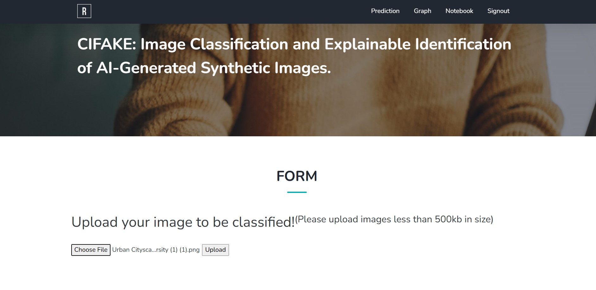
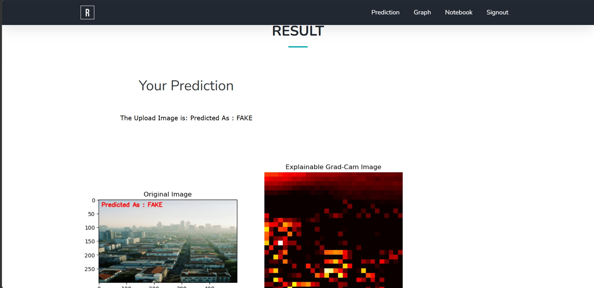
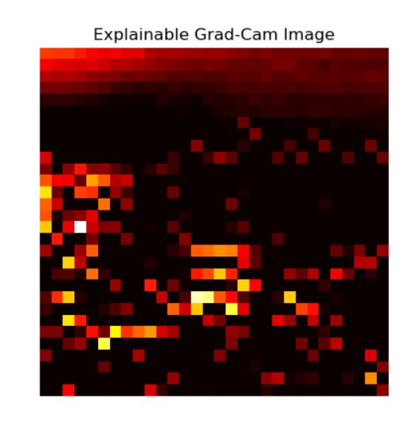

# CIFAKE Image Classification and Explainable Identification of AI-Generated Synthetic Images

## Overview

This project detects AI-generated synthetic images and classifies them using deep learning techniques. It also provides explainable predictions through visualization and analysis.

## Features

* AI-generated image detection
* CNN-based image classification
* Explainable AI visualization
* Web-based interface using Flask
* Performance evaluation metrics

## Technologies Used

* Python
* TensorFlow / Keras
* Flask
* HTML, CSS, JavaScript
* NumPy
* OpenCV

## Project Structure

* Dataset/
* model/
* static/
* templates/
* app.py

## How to Run

### 1. Clone the Repository

```bash
git clone https://github.com/mohitgautam1506-hue/CIFAKE-Image-Classification.git
```

### 2. Navigate to Project Directory

```bash
cd CIFAKE-Image-Classification
```

### 3. Install Required Dependencies

```bash
pip install -r requirements.txt
```

### 4. Run the Application

```bash
python app.py
```

### 5. Open in Browser

```text
http://127.0.0.1:5000/index
```

## Results

The system classifies images into:

* FAKE (AI-Generated Image)
* REAL (Authentic Image)

The project also provides Explainable AI visualization using Grad-CAM to highlight important regions influencing the prediction.

## Application Screenshots

### Home Page


### Login Page


### Dashboard


### Upload Image


### Prediction Result


### Grad-CAM Visualization


## Author

Mohit Gautam
B.Tech Artificial Intelligence and Data Science
